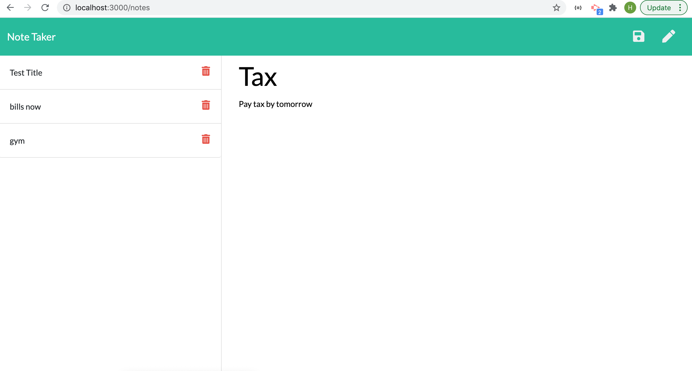
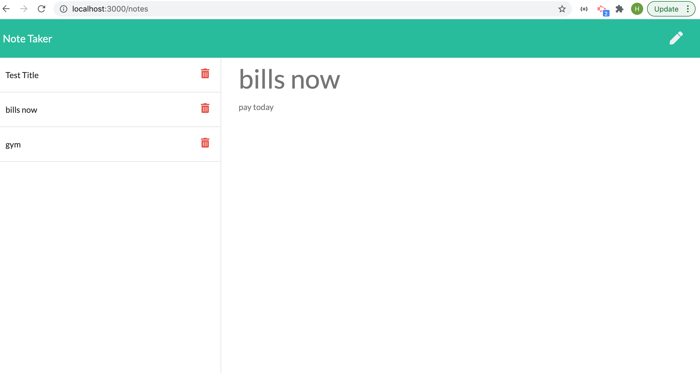

# note-taker-app

## Description

I was given a task to create an application called Note Taker that can be used by a small business owner to write and save notes so they can organize their thoughts and keep track of tasks they need to complete.
This application will use an Express.js back end and will save and retrieve note data from a JSON file.

## Getting Started

-npm install

## What We did

- installed express module
- installed nodemon as dependencies
- used CURD operations with GET, POST and DELETE methods
- created and connected routes i.e api and html

##  Screenshot

## Link
https://lit-temple-93415.herokuapp.com/
